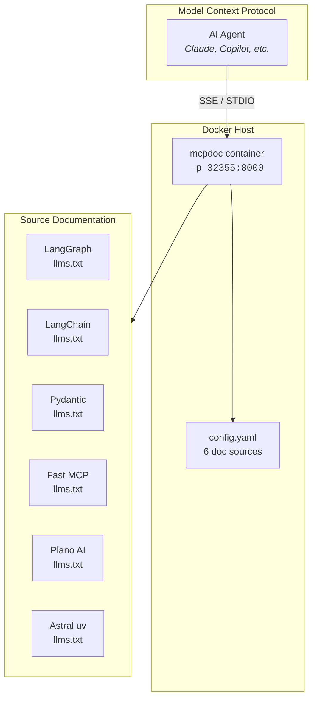
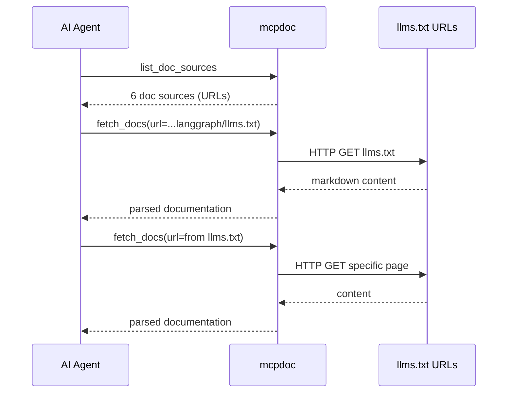

<p align="center">
  <a href="#quick-start"></a>
  <a href="#usage"></a>
  <a href="#usage"></a>
  <a href="https://pypi.org/project/mcpdoc/"></a>
</p>

---

## What is mcpdoc?

**mcpdoc** turns documentation websites into MCP tools. It fetches [`llms.txt`](https://llmstxt.org/) files from configured sources and makes their content available through the [Model Context Protocol (MCP)](https://modelcontextprotocol.io/).

Use it to give AI assistants real-time access to framework docs, API references, and technical guides — without dumping terabytes into context windows.

```
LLM/AI Agent  ←→  MCP Protocol  ←→  mcpdoc  ←→  llms.txt URLs
                                            ↕
                                       Documentation
                                       (on demand)
```

---

## Architecture



---

## Quick start

```bash
# 1. Build the image
docker build --progress=plain -t mcpdoc .

# 2. Run as SSE server (default)
docker run --rm -d -p 32355:8000 mcpdoc

# 3. Connect from AI client
curl -N http://localhost:32355/sse
# → event: endpoint
# → data: /messages/?session_id=<id>
```

---

## Usage

### SSE mode (server)

Serve documentation as an MCP SSE endpoint — the primary use case. The Docker container is configured by default to run as an SSE server bound to `0.0.0.0:8000`.

```bash
# Default: port 8000, 6 doc sources, SSE transport
docker run --rm -d -p 32355:8000 mcpdoc

# Custom port mapping, explicit transport
docker run --rm -d -p 8080:8000 mcpdoc --transport=sse --port=8000
```

<details>
<summary>Full MCP handshake example</summary>

```bash
# 1. Open SSE connection → get session_id
curl -N http://localhost:32355/sse
# event: endpoint
# data: /messages/?session_id=abc123...

# 2. Initialize
curl -X POST "http://localhost:32355/messages/?session_id=abc123..." \
  -H "Content-Type: application/json" \
  -d '{"jsonrpc":"2.0","id":1,"method":"initialize","params":{"protocolVersion":"2024-11-05","capabilities":{},"clientInfo":{"name":"my-client","version":"1.0"}}}'

# 3. List tools
curl -X POST "http://localhost:32355/messages/?session_id=abc123..." \
  -H "Content-Type: application/json" \
  -d '{"jsonrpc":"2.0","id":2,"method":"tools/list"}'

# 4. List doc sources
curl -X POST "http://localhost:32355/messages/?session_id=abc123..." \
  -H "Content-Type: application/json" \
  -d '{"jsonrpc":"2.0","id":3,"method":"tools/call","params":{"name":"list_doc_sources","arguments":{}}}'

# 5. Fetch docs
curl -X POST "http://localhost:32355/messages/?session_id=abc123..." \
  -H "Content-Type: application/json" \
  -d '{"jsonrpc":"2.0","id":4,"method":"tools/call","params":{"name":"fetch_docs","arguments":{"url":"https://langchain-ai.github.io/langgraph/llms.txt"}}}'
```

Responses arrive as SSE `event: message` on the same connection.
</details>

### STDIO mode

Connect directly to the container's stdio — for local CLI or embedded MCP clients.

```bash
# STDIO mode
echo '{}' | docker run --rm -i mcpdoc

# With different config
echo '{}' | docker run --rm -i mcpdoc --yaml /app/config.yaml
```

### Custom config

Mount or override the configuration file:

```bash
# Mount your own config
docker run --rm -d -p 32355:8000 \
  -v $(pwd)/my-config.yaml:/app/config.yaml \
  mcpdoc

# Override with inline arguments
docker run --rm -d -p 32355:8000 mcpdoc \
  --urls "FastMCP:https://gofastmcp.com/llms-full.txt"
```

---

## Configuration

### `config.yaml`

Define documentation sources as a list of `llms.txt` URLs:

```yaml
- name: LangGraph Python
  llms_txt: https://langchain-ai.github.io/langgraph/llms.txt
- name: LangChain Python
  llms_txt: https://python.langchain.com/llms.txt
- name: Pydantic Validation
  llms_txt: https://pydantic.dev/docs/validation/latest/llms.txt
- name: Fast MCP
  llms_txt: https://gofastmcp.com/llms-full.txt
- name: Plano AI
  llms_txt: https://docs.planoai.dev/includes/llms.txt
- name: Astral uv uvx
  llms_txt: https://docs.astral.sh/uv/llms.txt
```

### Adding a documentation source

1. Find the project's `llms.txt` URL (convention: `https://<domain>/llms.txt`)
2. Add it to `config.yaml`:
   ```yaml
   - name: My Framework
     llms_txt: https://my-framework.dev/llms.txt
   ```
3. Rebuild or mount the config:
   ```bash
   docker build --progress=plain -t mcpdoc .
   # or
   docker run -v $(pwd)/config.yaml:/app/config.yaml ...
   ```

### Using `--urls` (no config file needed)

```bash
docker run --rm -d -p 32355:8000 mcpdoc \
  --urls "LangGraph:https://langchain-ai.github.io/langgraph/llms.txt" \
  --urls "FastMCP:https://gofastmcp.com/llms-full.txt"
```

---

## Available tools

Once connected, the MCP server exposes two tools:

| Tool | Description | Trigger |
|------|-------------|---------|
| `list_doc_sources` | List all configured documentation sources | First call |
| `fetch_docs` | Fetch documentation by URL | After getting sources |



---

## Image reference

| Layer | Content | Size |
|-------|---------|------|
| ubuntu:24.04 | Base OS | ~78 MB |
| apt packages | ca-certificates, curl | ~10 MB |
| `/opt/mcpdoc` | mcpdoc + Python 3.14 + 42 packages | ~157 MB |
| config | Configuration | ~1 kB |
| **Total** | | **~334 MB** |

### Security

- Runs as **non-root** user `mcpdoc` (uid 568)
- `USER mcpdoc` in Dockerfile — no `root` processes
- `EXPOSE 8000` for SSE server mode

---

## Development

```bash
# Prerequisites
# - Docker 24+

# Build
docker build --progress=plain -t mcpdoc .

# Test SSE mode
docker run --rm -d -p 32355:8000 mcpdoc                        # SSE server

# Test STDIO mode
echo '{}' | docker run --rm -i mcpdoc                        # STDIO

# Check container info
docker inspect --format='{{json .State}}' $(docker ps -lq)

# Run with custom config (mount)
docker run --rm -d -p 32355:8000 \
  -v $(pwd)/config.yaml:/app/config.yaml \
  mcpdoc
```

### Project structure

```
mcpdoc/
├── .dockerignore            # Tight build context
├── Dockerfile               # Multi-stage build
├── config.yaml              # 6 documentation sources
└── .github/
    └── README.md            # This file
```

---

## CLI reference

```
mcpdoc [OPTIONS]

Options:
  --yaml, -y PATH      YAML config file with doc sources
  --json, -j PATH      JSON config file with doc sources
  --urls, -u LIST      llms.txt URLs (format: name:url)
  --follow-redirects   Follow HTTP redirects
  --timeout FLOAT      HTTP timeout in seconds (default: 10)
  --transport MODE     Transport: stdio | sse (default: stdio)
  --host TEXT          Bind host for SSE mode (default: 127.0.0.1)
  --port INT           Bind port for SSE mode (default: 8000)
  --log-level LEVEL    DEBUG | INFO | WARNING | ERROR
  --allowed-domains    Additional allowed domains ('*' = any)
  --help, -h           Show help
  --version, -V        Show version
```

---

## Troubleshooting

| Problem | Cause | Fix |
|---------|-------|-----|
| `port is already allocated` | Container from previous run | `docker rm -f <container>` |
| `curl: (7) Connection refused` | Server not ready | Wait for service to start |
| `Permission denied` | Wrong user ownership | Rebuild with `docker build --no-cache` |

---

<p align="center">
  <sub>Built with <a href="https://docs.astral.sh/uv/">uv</a> · <a href="https://pypi.org/project/mcpdoc/">mcpdoc on PyPI</a></sub>
</p>
